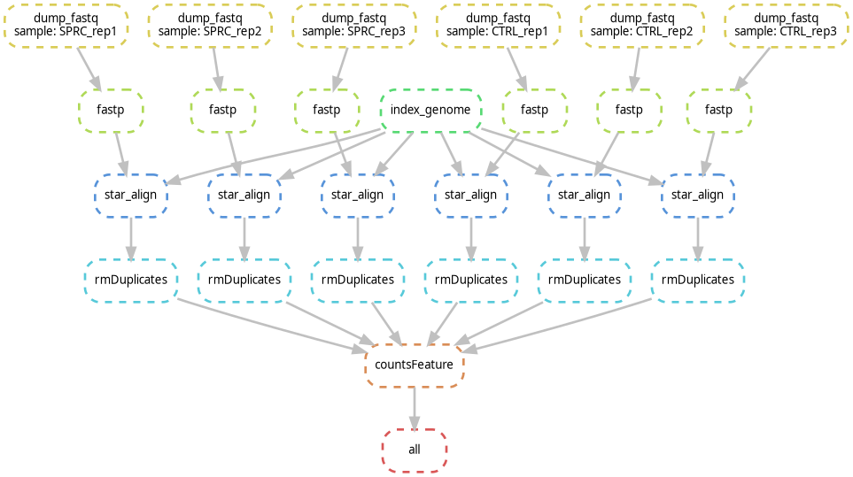

# Snakemake Pipeline for RNA-seq and DE Analysis

<div style="text-align: justify">

This project explores the effects of hydrogen sulfide (H₂S) on Saccharomyces cerevisiae through RNA-seq analysis. The analysis pipeline is built using Snakemake and includes key steps like quality control, alignment and read counting. Differential expression analysis using DESeq2, and KEGG pathway enrichment.

</div>

## Project Structure

```
├── analysis                    # RNA seq analysis
│   ├── RNAseqAnalysis.html     
│   └── RNAseqAnalysis.Rmd
├── environnement.yml
├── README.md                   
└── snakemake
    ├── dag.png                 # Snakemake DAG (Directed Acyclic Graph)
    ├── fastpQC                 # Quality control reports generated by Fastp
    ├── featureCounts           # Gene count data from featureCounts
    ├── genome                  # Reference genome files
    ├── rawReads                # Raw data
    ├── Snakefile               # Workflow file
    ├── starAligned             # Aligned RNA-seq data (STAR alignment)
    ├── starIndex               # STAR genome index files
    ├── trimmedReads            # Trimmed RNA-seq reads
    └── snakemake.yml       # Conda environment file for sankemake pipeline
```

## Snakemake Pipeline

<div style="text-align: justify">

The Snakemake workflow file `Snakefile` describes the steps involved in the data preprocessing, alignment, and read counting processes. 
The details of how the Snakemake pipeline was built, are explained in the RNA-seq Analysis Report `RNAseqAnalysis.html`, which can be found in the `analysis` folder.


    
</div>

## Requirements

<div style="text-align: justify">

The project uses a conda environment. To install the required dependencies, create the environment using the provided `environment.yml`

</div>

```
conda env create -f snakemake.yml
conda activate snakemake
```

## Running the Sankemake pipeline

To run the Snakemake workflow, execute the following command from the `snakemake` directory

```
snakemake --use-conda -j <number-of-cores>
```

## Results

<div style="text-align: justify">

The results of the RNA-seq analysis, including the differential expression analysis, and pathway enrichment,
are detailed in the RNA-seq Analysis Report `RNAseqAnalysis.html` found in the analysis folder.

</div>
