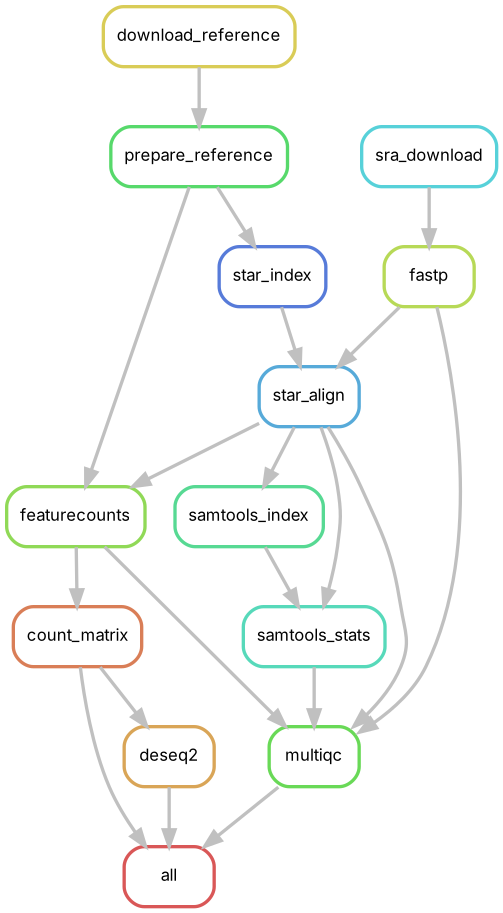
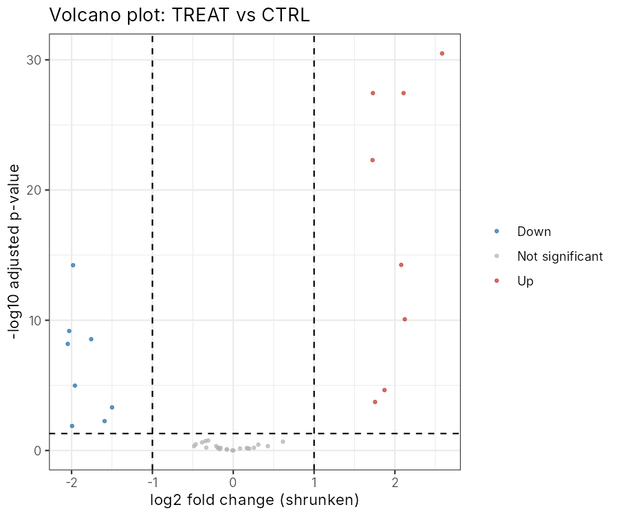

# RNA-seq Snakemake workflow: from SRA reads to differential expression

[](https://github.com/youcef-benmohammed/rnaseq.analysis/actions/workflows/ci.yml)
[](https://snakemake.github.io)
[](LICENSE)

A reproducible Snakemake workflow for paired-end bulk RNA-seq. It takes reads from SRA or local
FASTQ files and runs quality control, alignment, gene-level counting and differential expression
with DESeq2, then gathers everything into a MultiQC report.

The workflow is applied to the response of *Saccharomyces cerevisiae* to hydrogen sulfide
released by S-propargyl-cysteine (SPRC) treatment
(3 SPRC vs 3 control samples, SRA [SRR13978640–SRR13978645](https://www.ncbi.nlm.nih.gov/sra/?term=SRR13978640)).
Downstream interpretation, including KEGG pathway enrichment, is in the
[analysis report](analysis/RNAseq_Analysis.html).



## Steps

| Step | Tool | Output |
|---|---|---|
| Download reads (optional) | `fasterq-dump` (SRA Toolkit) | `resources/reads/` |
| Reference download and STAR index | `curl`, `STAR` | `resources/` |
| Adapter and quality trimming, read QC | `fastp` | `results/qc/fastp/` |
| Spliced alignment | `STAR` | `results/star/{sample}/` |
| BAM index and alignment statistics | `samtools` | `results/qc/samtools/` |
| Gene-level counting (read pairs) | `featureCounts` | `results/counts/counts.tsv` |
| Differential expression | `DESeq2` (+ `lfcShrink`) | `results/diffexp/` |
| Aggregated QC report | `MultiQC` | `results/multiqc/multiqc_report.html` |

Design choices:
- **Duplicates are not removed.** In RNA-seq, most duplicate reads come from highly expressed
  genes, not from PCR. Removing them caps the counts of those genes and biases quantification,
  so duplication is only reported (fastp, samtools stats).
- **Pairs are counted once** (`featureCounts -p --countReadPairs`), and chimeric or multi-mapped
  pairs are excluded.
- **Fold changes are shrunk** (`lfcShrink`, type `normal`) before classifying genes as Up or Down.
  The raw MLE estimate is kept in the results table.
- Every rule has its own pinned conda environment and log file. Inputs (config file and sample
  sheet) are validated against JSON schemas before anything runs.

## Quick start

```bash
# 1. Snakemake >= 8 (conda / mamba)
conda create -n snakemake -c conda-forge -c bioconda snakemake-minimal pandas
conda activate snakemake

# 2. Clone
git clone https://github.com/youcef-benmohammed/rnaseq.analysis.git
cd rnaseq.analysis

# 3. Try it on the tiny synthetic dataset (~1 min)
snakemake --directory .test --cores 4 --sdm conda

# 4. Run the real analysis (downloads reads and the yeast genome)
snakemake --cores 8 --sdm conda
```

### On an HPC cluster (SLURM)

```bash
pip install snakemake-executor-plugin-slurm
snakemake --workflow-profile workflow/profiles/slurm
```

Partition, memory and runtime are set in
[`workflow/profiles/slurm/config.yaml`](workflow/profiles/slurm/config.yaml).

## Configuration

**[`config/samples.tsv`](config/samples.tsv)** has one row per sample. Reads come either from SRA
(`sra` column) or from local paired FASTQ files (`fq1`, `fq2`).

```
sample      condition  replicate  sra          fq1                   fq2
CTRL_rep1   CTRL       1          SRR13978643
SPRC_rep1   SPRC       1                       data/S1_R1.fastq.gz   data/S1_R2.fastq.gz
```

**[`config/config.yaml`](config/config.yaml)** sets:
- the reference (URL or local path);
- trimming and STAR options;
- library strandedness for featureCounts;
- the DESeq2 design formula and the contrasts (`name: [variable, numerator, reference]`);
- the FDR and |log2FC| thresholds.

## Outputs

```
results/
├── multiqc/multiqc_report.html        # fastp + STAR + samtools + featureCounts QC
├── counts/counts.tsv                  # gene x sample raw counts
└── diffexp/
    ├── {contrast}.results.tsv         # all genes, MLE and shrunken log2FC, padj, status
    ├── {contrast}.volcano.png / .ma.png
    ├── normalized_counts.tsv
    ├── pca.png, sample_distances.png  # sample-level QC on VST counts
    └── dds.rds                        # DESeqDataSet for further analysis in R
```

## Testing

`.test/` contains a synthetic dataset generated by
[`.test/make_test_data.py`](.test/make_test_data.py): a 120 kb genome with 40 genes and
2 × 3 paired-end samples. Eight genes are simulated 4× up and eight 4× down. On every push,
GitHub Actions does three things:

1. checks formatting (`snakefmt`) and runs `snakemake --lint`;
2. dry-runs the real configuration;
3. runs the full workflow on the test data with conda, and checks with
   [`.test/check_results.py`](.test/check_results.py) that DESeq2 recovers the simulated genes.

| Example output on the test data |
|---|
|  |

## Repository structure

```
├── config/                 # config.yaml + samples.tsv (the real analysis)
├── workflow/
│   ├── Snakefile
│   ├── rules/              # common, ref, reads, align, count, diffexp, qc
│   ├── envs/               # one conda environment per tool
│   ├── scripts/            # count_matrix.py, deseq2.R
│   ├── schemas/            # validation of config and sample sheet
│   └── profiles/           # default (local) and slurm execution profiles
├── .test/                  # synthetic dataset, its config and the results check
├── analysis/               # R Markdown report: DE interpretation and KEGG enrichment
└── .github/workflows/ci.yml
```

The report in `analysis/` was produced with the first version of this workflow, before it was
restructured, and still describes the original rules.

## License

MIT, see [LICENSE](LICENSE).
